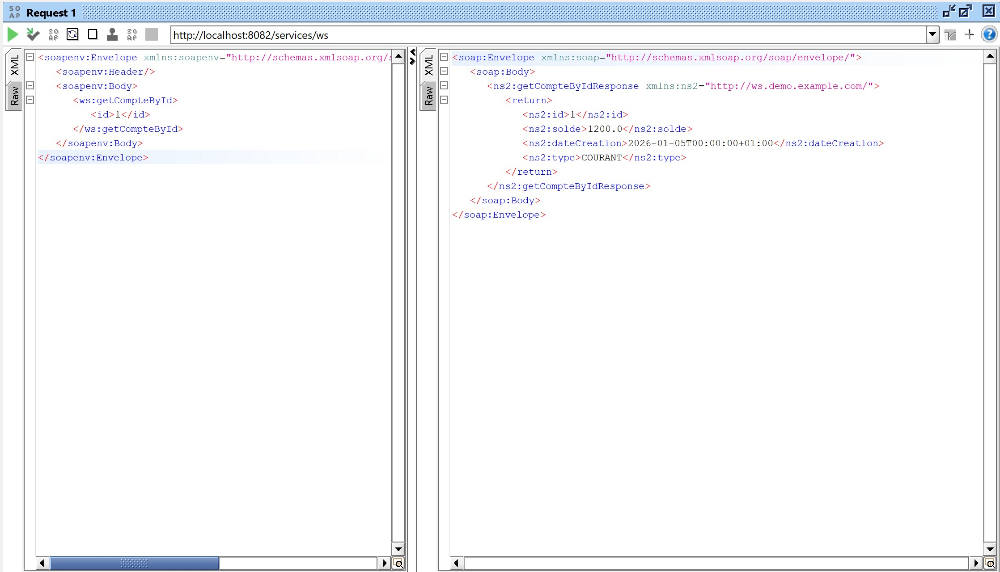
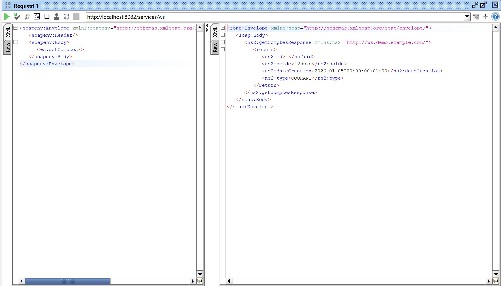

# TP13 - Service Web SOAP avec Spring Boot et Apache CXF

Ce projet implémente un service web SOAP pour la gestion de comptes bancaires.

## Fonctionnalités
- **CompteSoapService**: Service web exposé via Apache CXF.
- **Opérations**: `getComptes`, `getCompteById`, `createCompte`, `deleteCompte`.
- **Base de données**: H2 (en mémoire).

## Tests avec SoapUI

Voici les résultats des tests effectués sur les différentes méthodes du service web :

### 1. getComptes
Cette méthode permet de récupérer la liste complète des comptes bancaires enregistrés.

### 2. getCompteById
Cette méthode permet de consulter les détails d'un compte spécifique en fournissant son identifiant (ID).

### 3. createCompte
Cette méthode permet de créer un nouveau compte en spécifiant le solde initial et le type de compte (COURANT ou EPARGNE).

### 4. deleteCompte
Cette méthode permet de supprimer un compte existant à partir de son identifiant.

